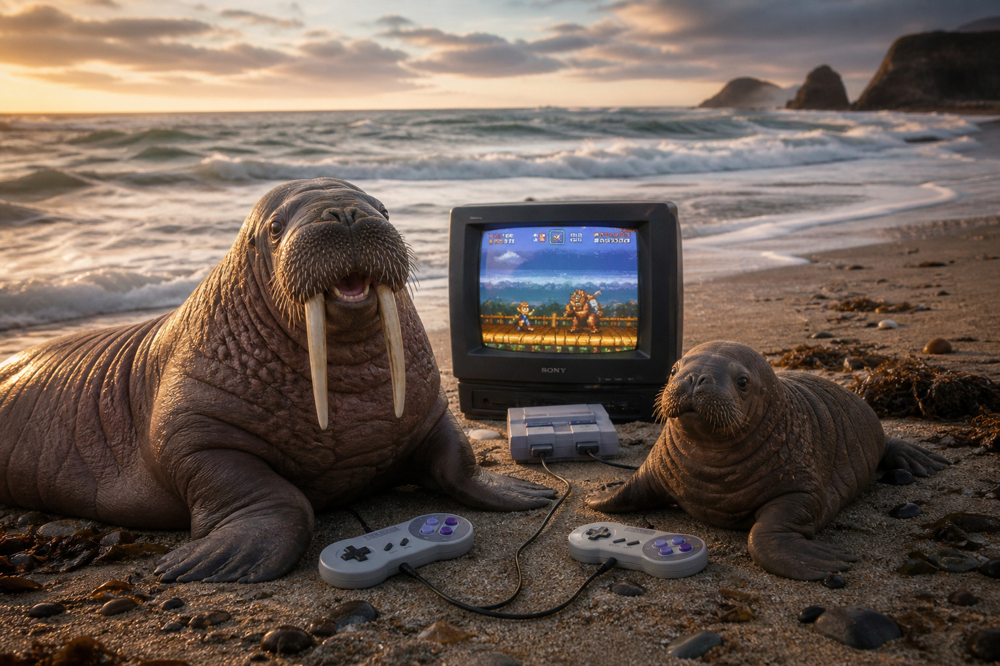

# Walrus  🦭🦷
### A Kotlin Multiplatform webgl-wrapper

<p align="center">
    
</p>

## What is this?!
This project is a thin wrapper around the great [](https://github.com/parkwoocheol/compose-webview) library from [Parkwoocheol](https://github.com/parkwoocheol/compose-webview/commits?author=parkwoocheol). This wrapper adds ergonomics and type support for WebGL games, mime types and IO over JSBridge.
Currently supporting Android and iOS, and does not require the creation of a local server.

## Adding a game as a resource for the WebView

Put your WebGL build inside `libs/core/composeResources/files/` so it is packaged by the Compose resource processor:

```
libs/core/composeResources/files/
└── <game-name>/
    ├── index.html      ← entry point
    ├── index.js
    ├── index.wasm
    └── ...
```

The folder name becomes the `startPath` prefix. The entry point must be `index.html`.

> **Android only:** if your build contains pre-compressed `.br` or `.gz` assets, add this to your `android-app` build config so AAPT does not re-compress them:
> ```
> aaptOptions { noCompress 'br', 'gz', 'wasm' }
> ```
>  **Critical note for AAPT usage:**
> 
> [](https://www.youtube.com/watch?v=ekr2nIex040)


# Running your game
To run a game, a reader must be initialized, and then you can call the WebGLWebView composable to display your game. 

```kotlin
val reader = remember { ComposeResourceAssetReader() }

WebGLWebView(
    startPath = "<game-name>/index.html",
    reader = reader,
    modifier = Modifier.fillMaxSize(),
)
```

`ComposeResourceAssetReader` reads from `composeResources/files/` automatically. If you need to serve assets from the filesystem at runtime, implement an `AssetReader` interface according to the `AssetReader.kt` example.

## Communicating with the game

All communication goes through a `WebViewJsBridge`. You choose the event names - the library imposes none. Create a bridge with `rememberWebViewJsBridge()`, add any handlers you might need, then pass it to `WebGLWebView`.

**Kotlin side:**

```kotlin
val bridge = rememberWebViewJsBridge()

// Host → Game: emit a named event with any value
LaunchedEffect(myValue) {
    bridge.emit("your_event_name", myValue)
}

// Game → Host: register a handler for events the game sends
LaunchedEffect(bridge) {
    bridge.register<String, Unit>("your_other_event") { json ->
        println("received: $json")
    }
}

WebGLWebView(
    startPath = "<game-name>/index.html",
    reader = reader,
    jsBridge = bridge,
    modifier = Modifier.fillMaxSize(),
)
```

**Game side (In this example, Godot GDScript):**

```gdscript
var _bridge = JavaScriptBridge.get_interface("window").AppBridge
# Callback must be stored as a member variable - local vars get GC'd silently
var _callback = JavaScriptBridge.create_callback(func(args): handle(args[0]))

func _ready():
    _bridge.on("your_event_name", _callback)
```

**Optional: forward game console output to the platform log**


## Demo (under `libs/core/sample`)

`ResponseInterceptionTestScreen` (in `libs/core`) loads `composeResources/files/test/index.html` and shows two input modes:

- **Linear** - linear constant input for testing, 0.0 → 1.0 emits `"input_value"` via bridge
- **Button** - D-pad buttons (↑ ↓ ← → Space), each emits a distinct float via the same event

Run the `android-app` or `ios-app` targets to try it. The test page doesn't consume the bridge events - it only verifies that asset interception works. Swap `"test/index.html"` for your own game to see it end-to-end.

## Project structure

```
android-app/   Android entry point
ios-app/       iOS entry point
shared/        Screen composable (common)
libs/core/     WebGLWebView, AssetReader, MIME map, interception pipeline
```

🤖 Honest Disclaimer: Yes, AI processed some of this readme's blocks for clarity. 🤖